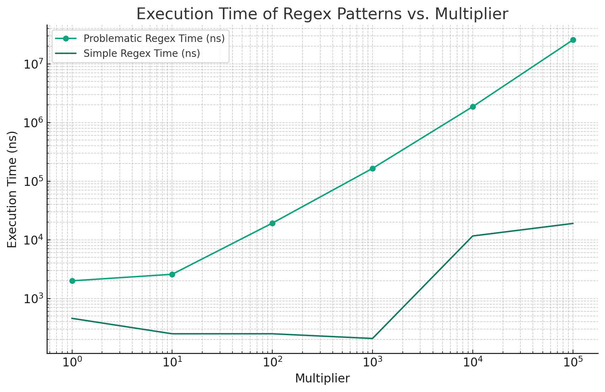

Recently, I was debugging a Python application that had become stuck while processing certain inputs. The process was taking up 100% CPU time but not making progress. To try and figure out where the application was getting stuck, I turned to a handy profiling tool called [py-spy](https://github.com/benfred/py-spy).

# Using py-spy to Find the Bottleneck

py-spy is a sampling profiler for Python that lets you see where your code is spending time without modifying it. It can be used to get information from running Python processes, which is very helpful! I used the `py-spy dump` command to attach to the stuck Python process and print out a snapshot of the current call stack across all threads.

You can use py-spy on a specific process ID by running

```bash
py-spy dump --pid <pid>
```

In my case, the result looked like this:

```bash
  %Own   %Total  OwnTime  TotalTime  Function (filename)
100.00% 100.00%   18.00s    18.00s   search (re.py)
  0.00% 100.00%   0.000s    18.00s   process_item (pipelines/summarization.py)
  0.00% 100.00%   0.000s    18.00s   execute (scrapy/cmdline.py)
  0.00% 100.00%   0.000s    18.00s   <module> (pex)
  0.00% 100.00%   0.000s    18.00s   _run_command (scrapy/cmdline.py)
  0.00% 100.00%   0.000s    18.00s   run_module (runpy.py)
  0.00% 100.00%   0.000s    18.00s   <module> (scrapy/__main__.py)
  0.00% 100.00%   0.000s    18.00s   _run_code (runpy.py)
  0.00% 100.00%   0.000s    18.00s   run (scrapy/commands/crawl.py)
  0.00% 100.00%   0.000s    18.00s   get_quotes_summary (ml/summarization.py)
  0.00% 100.00%   0.000s    18.00s   _run_module_code (runpy.py)
  0.00% 100.00%   0.000s    18.00s   run (twisted/internet/asyncioreactor.py)
  0.00% 100.00%   0.000s    18.00s   start (scrapy/crawler.py)
  0.00% 100.00%   0.000s    18.00s   _run_print_help (scrapy/cmdline.py)
```

This application is a [Scrapy](https://scrapy.org/) spider, which explains why Scrapy and Twisted show up in the stack trace.

Here is what the columns mean:

* `%Own`: % of time currently spent in the function.
* `%Total`: % of time currently spent in the function and all the functions it called (children).
* `OwnTime`: Total amount of CPU time that was spent in the function itself, excluding any functions it called.
* `TotalTime`: Total amount of CPU time that was spent in the function and all its children.
* `Function (filename)`: This is the name of the function and the file where it is defined.

From the output above, we can see that the [`re.search`](https://docs.python.org/3/library/re.html#re.search) function from Python's regex module takes up 100% of the process time, and the execution time is spent in this function directly rather than in any children that it calls.

# Catastrophic Backtracking in Regular Expressions

Now that I knew the culprit was a regex and where it was being called, I looked at the code:

```python
pattern = r'<summary>((\n*.*\n*)*)</summary>'
regex_match = re.search(pattern, content.strip())
```

This regex parses output that is returned from a large language model, and tries to match text within `<summary>` tags as output by the LLM. It also explicitly matches newlines before and after each block of text. It defines capture groups for the whole content of the summary tags, as well as each newline-delimited match group.

So what's the problem here?

By default, the match characters for `*` (zero or more), `+` (one or more), and `?` (zero or one) are matched greedily. If we look at the [Python documentation](https://docs.python.org/3/library/re.html#regular-expression-syntax), we see:

> `*?`, `+?`, `??`
>
> The `'*'`, `'+'`, and `'?'` quantifiers are all greedy; they match as much text as possible. Sometimes this behaviour isn’t desired; if the RE `<.*>` is matched against `<a> b <c>`, it will match the entire string, and not just `<a>`. Adding ? after the quantifier makes it perform the match in non-greedy or minimal fashion; as few characters as possible will be matched. Using the RE `<.*?>` will match only `<a>`.

The problem is the expression `((\n*.*\n*)*)` - by repeating a newline-sandwiched pattern greedily, it leads to exponential runtime on strings with many newlines, as the engine tries every possible way to match newlines.

This is known as *catastrophic backtracking*. The regex engine matches as far as it can initially with a greedy subpattern, then backtracks trying every possible matching combination before failing.

## Fixing with a Non-Greedy Pattern

What we really want here is just to match all the text inside `<summary>` tags in a **non-greedy** fashion - if there are multiple `<summary>` tags, their contents should match separately.

To avoid catastrophic backtracking, the key is to make the repeating subpattern non-greedy, by adding the character `?` to the end as shown above in the documentation. Additionally, since we want to match newlines inside the tags, we add the `re.DOTALL` flag to ensure that the `.` character matches newlines as well.

```python
pattern_str = r"<summary>(.*?)</summary>"
regex_match = re.search(pattern_str, content.strip(), flags=re.DOTALL)
```

Now, we get the smallest possible sequence of characters that are in between `<summary>` tags. This avoids getting stuck trying to match newlines exhaustively, and is also much easier to read!

Making the pattern non-greedy prevents the combinatorial explosion and makes the runtime linear rather than exponential in the worst case.


## Differences in performance

### Test script

Here is an small script I ran to compare the performance of both regexes. The idea behind this script is to use a pattern with a few newlines (`a\nb\nc`) and multiply this by some factor to induce a string with more newlines that can get caught by the repeating greedy match in the original regex. Addiitonally, we remove the `<summary>` tags surrounding the input as it is not needed to demonstrate the behavior.

Additionally, we use the [re.compile](https://docs.python.org/3/library/re.html#re.compile) method to create a regular expression object that can be reused many times in the same program more efficiently. This call also lets us pass in the `re.DOTALL` flag once when the regex is created rather than on every invocation.

Note that **both** regexes are compiled before they are used to ensure consistency.

    ```python
    import re
    import time


    def measure_regex_time_ns(multiplier: int):
        # Create input strings based on the multiplier
        input_str = 'a\nb\nc' * multiplier

        # Problematic regex pattern with potential for catastrophic backtracking
        problematic_pattern = re.compile(r'((\n*.*\n*)*)')

        # Simplified pattern that doesn't cause backtracking, with re.DOTALL flag and non-greedy matching
        simple_pattern_non_greedy = re.compile(r'(.*?)', re.DOTALL)

        # Measure time taken for matching with problematic pattern using re.search
        start_time = time.perf_counter_ns()
        regex_match = problematic_pattern.search(input_str)
        end_time = time.perf_counter_ns()
        problematic_time = end_time - start_time

        # Measure time taken for matching with simplified pattern using re.search
        start_time = time.perf_counter_ns()
        regex_match = simple_pattern_non_greedy.search(input_str)
        end_time = time.perf_counter_ns()
        simple_time_non_greedy = end_time - start_time

        return problematic_time, simple_time_non_greedy


    def main():
        # Test the function with multiples for string length (1, 10, 100, 1000, 10000, 100000)
        multipliers = [int(10 ** i) for i in range(6)]
        for multiplier in multipliers:
            problematic_time, simple_time = measure_regex_time_ns(multiplier)
            print("Multiplier:", multiplier)
            print("Problematic Regex Time (ns):", problematic_time)
            print("Simple Regex Time (ns):", simple_time)
            print("Ratio of Times:", problematic_time / simple_time)
            print("-" * 30 + "\n" * 3)


    if __name__ == "__main__":
        main()
    ```

### Results


  Here were the results with various input values for `multiplier` from running on my laptop (Macbook Pro M1 Max, 32GB RAM) using Python 3.11.3.

  ```bash
  Multiplier: 1
  Problematic Regex Time: 2708
  Simple Regex Time: 500
  Ratio of Times: 5.416
  ------------------------------


  Multiplier: 10
  Problematic Regex Time: 3292
  Simple Regex Time: 292
  Ratio of Times: 11.273972602739725
  ------------------------------


  Multiplier: 100
  Problematic Regex Time: 19042
  Simple Regex Time: 250
  Ratio of Times: 76.168
  ------------------------------


  Multiplier: 1000
  Problematic Regex Time: 160291
  Simple Regex Time: 250
  Ratio of Times: 641.164
  ------------------------------


  Multiplier: 10000
  Problematic Regex Time: 1809958
  Simple Regex Time: 708
  Ratio of Times: 2556.437853107345
  ------------------------------


  Multiplier: 100000
  Problematic Regex Time: 20424917
  Simple Regex Time: 2792
  Ratio of Times: 7315.514684813754
  ------------------------------
  ```

As you can see, the problematic regex demonstrates increasingly poor performance on long input sequences, and scales incredibly poorly compared to the simple regex.

Below is a log-log plot of multiplier vs execution time which illustrates this relationship. Both the X and Y axes are scaled logarithmically to make the exponential relationship between the variables clearer.



As you can see, the execution time scales exponentially for the problematic regex as the input size scales. By contrast, the simple regex's execution time grows much more slowly and only increases by 1 order of magnitude even as the input size grows by 5 orders of magnitude!


### Plotting code

Here is the code used to generate this plot:

```python
import matplotlib.pyplot as plt
import numpy as np

# Data to plot
multipliers = np.array([1, 10, 100, 1000, 10000, 100000])
problematic_times = np.array([2000, 2583, 19250, 164875, 1860708, 25549500])
simple_times = np.array([458, 250, 250, 208, 11625, 19000])

# Plotting the data
plt.figure(figsize=(10, 6))
plt.loglog(multipliers, problematic_times, label='Problematic Regex Time (ns)', marker='o')
plt.loglog(multipliers, simple_times, label='Simple Regex Time (ns)', marker='x')
plt.xlabel('Multiplier')
plt.ylabel('Execution Time (ns)')
plt.title('Execution Time of Regex Patterns vs. Multiplier')
plt.legend()
plt.grid(True, which="both", ls="--")
plt.show()
```

# Conclusions

* Multiple levels of greedy matching can cause regex performance to spin out of control. Avoid using multiple levels of greedy matching if at all possible.
* Use non-greedy matching and flags to get better results.
* Use `re.compile` to compile regexes that are used many times in the same application and improve performance.


# Acknowledgements

Thanks to GPT-4 and Code Interpreter for helping me generate the plots for this blog post. I am notoriously bad at `matplotlib` so having GPT-4 generate the charts made it a lot easier for me.

Also thanks to Ben Frederickson, who created the `py-spy` library and also wrote a great post on catastrophic backtracking (linked below).

## Resources

* [An article on catastrophic backtracking by Ben Frederickson, author of py-spy](https://www.benfrederickson.com/python-catastrophic-regular-expressions-and-the-gil/)
* [Mozilla blog post on catstrophic backtracking from 2010](https://blog.mozilla.org/webdev/2010/11/15/avoiding-catastrophic-backtracking-in-apache-rewriterule-patterns/)
* [An interesting paper on detecting catastrophic backtracking statically in Java](https://arxiv.org/abs/1405.5599)
* [Coding Horror blog on regex performance from 2006](https://blog.codinghorror.com/regex-performance/)
